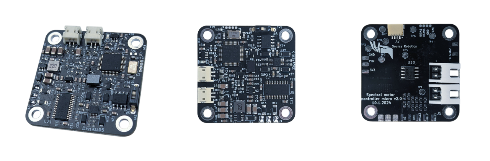

# Spectral micro BLDC controller
   

## 📖 Project Overview
Spectral Micro is a brushless motor controller designed to offer affordable and capable hardware, complemented by open-source software. 
* It supports multiple firmware options and integrates a 14-bit magnetic encoder, inline current sensing, CAN and UART data interface, and provides support for position, velocity, torque, and impedance control.
* Everything you need for developing high-performance robotic solutions is included.
* It is ideal for gimbal motors, quadrupeds, robotic arms, and grippers. Check the list of tested motors [here!](https://source-robotics.github.io/Spectral-BLDC-docs/apage9_3_tested_motors/)

## 🚀Where to buy?

You can buy the Spectral Micro BLDC controller here:  
 https://source-robotics.com/products/spectral-micro-bldc-controller

## 💾Firmware 
Spectral firmware is located [here](https://github.com/PCrnjak/Spectral-Micro-BLDC-controller/tree/main/Spectral%20BLDC%20Firmware). To install it follow [this guide!](https://source-robotics.github.io/Spectral-BLDC-docs/apage3_flashing_firmware/)

## 📚Documentation:

- [Official website](https://source-robotics.com/products/spectral-micro-bldc-controller)
- [DOCS](https://source-robotics.github.io/Spectral-BLDC-docs/) Offers great starting guides with project examples + code 

### API and control
- [GUI software ](https://github.com/PCrnjak/Spectral-motor-GUI)
- [Python API & Examples](https://github.com/PCrnjak/Spectral-BLDC-Python/tree/main)
- [Source Robotics toolbox](https://github.com/PCrnjak/Source-Robotics-Toolbox/tree/main) 
- [SimpleFOC port](https://github.com/PCrnjak/Spectral-Micro-Simple-FOC-)
- **Early stage**: [Arduino](https://github.com/PCrnjak/SpectralMicroArduino), [ROS2](https://github.com/PCrnjak/SpectralMicroROS2)

## 🌐 More about Spectral Micro drivers

| YouTube | Instagram | Twitter | LinkedIn |
|--------|-----------|---------|----------|
|  |  |  |  |

| Discord | Forum | Hackaday | Blog |
|--------|-------|------| ------|
|  |  |  |  

## ⚠️ Safety, Liability & Disclaimer
1. The software and hardware are still in development and may contain bugs, errors, or incomplete features.
2. Users are encouraged to use this software and hardware responsibly and at their own risk.

## 💸Support us

The majority of this project is open source and freely available to everyone. Your assistance, whether through donations or advice, is highly valued. Thank you!

 

## 🛡️ Licensing
Spectral firmware is under GPLv3 Licence
